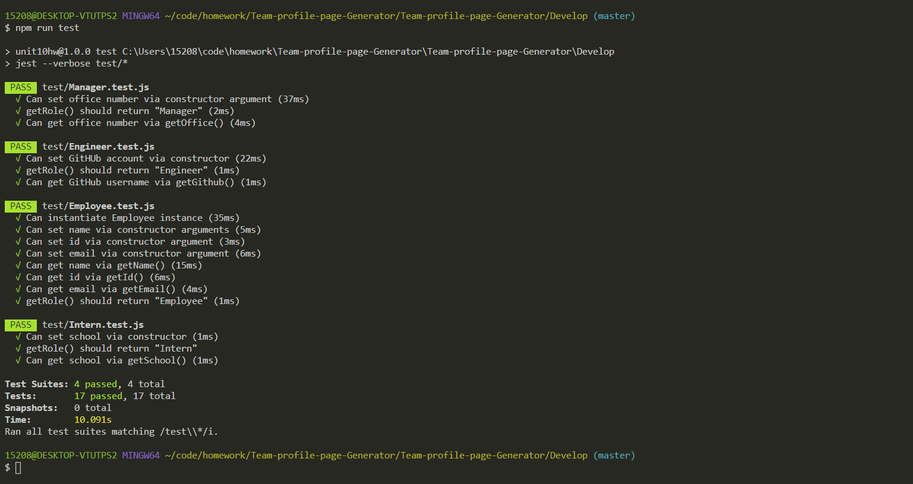
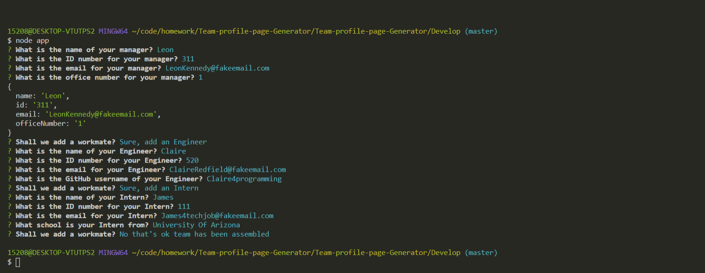
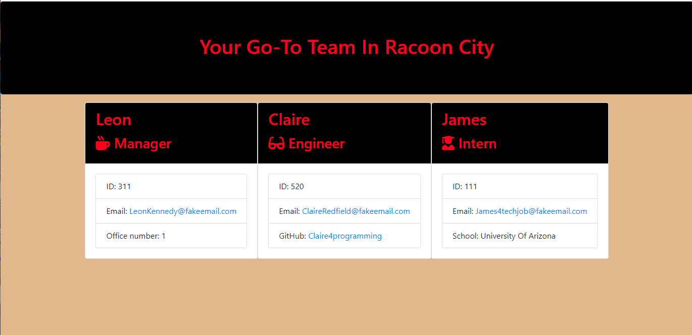

# Team-profile-page-Generator

##  Description
You will build a software engineering team generator command line application. The application will prompt the user for information about the team manager and then information about the team members. The user can input any number of team members, and they may be a mix of engineers and interns. This assignment must also pass all unit tests. When the user has completed building the team, the application will create an HTML file that displays a nicely formatted team roster based on the information provided by the user.

 

##  Table of Contents

*Description
*Installation
*Usage
*License
*Contributing
*Tests
*Screenshots of Demo

##  Installation

node.js, Visual Studios, you will need to do an npm i as well as create a .gitignore file.

##  Usage

using the app.js file by running node app you will be prompted with questions about your team that you want to generate. after answering all the questions you will get a generated html page on the team.html file that can then be viewed in the browser.

##  Contributing

James Nowak

##  Tests

After conducting many tests by way of npm run test I was able to target bugs and fix them eventually successfully passing all test files.

## Screenshots of Demo

